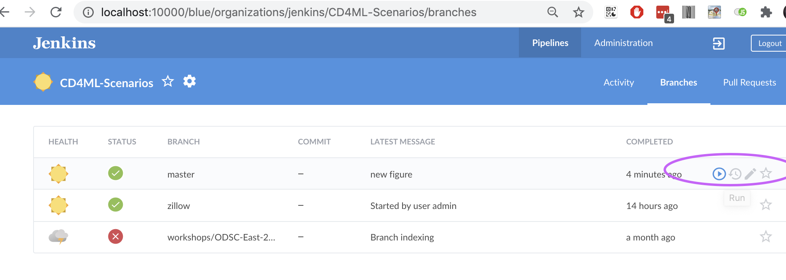
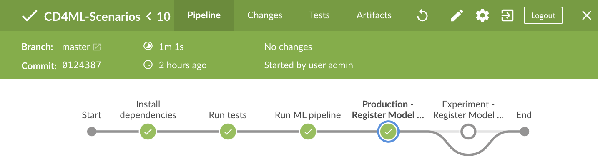
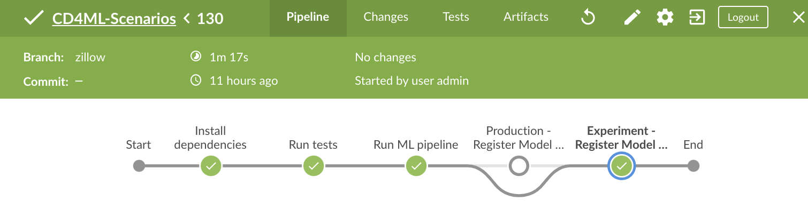

# Exercício 3 - Ciência de Dados e Machine Learning

## Objetivos

- Aprender a realizar experimentos sem interromper o restante do time ou alterar o modelo de produção.
- Conhecer o design da base de código e como ele possibilita flexibilidade enquanto mantém a reprodutibilidade.

---

## Instruções Passo a Passo

### Passo 1: Executar o pipeline no problema de moradia com os parâmetros padrão
1. Acesse a interface do Jenkins: [http://localhost:10000](http://localhost:10000).
2. Faça login, se necessário.
3. Abra o Blue Ocean (menu à esquerda, se não estiver aberto).
4. Clique no pipeline **CD4ML-Scenarios**.
5. Navegue para **Branches** e clique no botão de **play** ao lado da branch `master`.

   

6. Após a execução, verifique se o pipeline terminou com sucesso (indicador verde).

   

---

### Passo 2: Executar o pipeline no problema de moradia com algoritmos e parâmetros personalizados
1. No Jenkins UI, altere o algoritmo para `lasso`.
2. Insira `big_alpha` no campo de parâmetros.
3. Execute o pipeline novamente.

---

### Passo 3: Explorar a estrutura do diretório do problema
1. No diretório `cd4ml/problems`, observe os dois problemas disponíveis: `rendimento` e `insumo`.
2. Entre na pasta `rendimento` e examine os subdiretórios:
   - **algorithms**: Contém os algoritmos disponíveis, cada um com arquivos de parâmetros.
   - **features**: Define os conjuntos de features.
   - **ml_pipelines**: Contém informações como algoritmo padrão, divisão de dados de treinamento e validação, e métrica principal de ML.

3. Em `cd4ml/problems/rendimento/algorithms`, encontre o diretório `lasso`:
   - O arquivo `default.json` define os parâmetros padrão.
   - O arquivo `big_alpha.json` define o parâmetro `alpha` como 50 (ao invés de 1), promovendo maior esparsidade nos coeficientes do modelo. [Leia mais sobre esparsidade no Lasso Regression](https://chrisalbon.com/code/machine_learning/linear_regression/effect_of_alpha_on_lasso_regression/).

**Observação**: A criação de novos arquivos para configurações alternativas de parâmetros é preferível a editar os padrões. Isso evita impactar outros membros do time e mantém o modelo oficial intacto.

---

### Passo 4: Observar o resultado do modelo no Jenkins
1. Volte para o Jenkins e verifique que o modelo foi identificado como um experimento, devido ao uso de parâmetros não padrão.
2. O pipeline ignorou a etapa de registro do modelo de produção e executou a etapa de experimento.

   

**Observação**: Esta abordagem transforma o Jenkins em uma [plataforma de orquestração de treinamento de ML](https://github.com/EthicalML/awesome-production-machine-learning#model-training-orchestration).

---

### Passo 5: Explorar o diretório de conjuntos de features
1. No diretório `cd4ml/problems/rendimento/features`:
   - Copie o subdiretório `default` para criar um novo conjunto de features.
   - Edite os arquivos conforme necessário.

2. Para utilizar o novo conjunto de features:
   - Adicione uma opção de importação no arquivo `cd4ml/problems/rendimento/problem.py` (próximo à linha 34).
   - Este ajuste é necessário para que o Jenkins reconheça o novo conjunto de features.

---

### Passo 6: Explorar o diretório de pipelines de ML
1. No diretório `cd4ml/problems/rendimento/ml_pipelines`, localize o arquivo `default.json`:
   - Define o algoritmo padrão.
   - Configurações para divisão de treinamento/validação.
   - Métrica principal de ML e seus limites aceitáveis.

**Observação**: Divisões de treinamento e validação não precisam somar 100%. É possível trabalhar com conjuntos de dados menores ajustando esses valores.

---

## Próximos Passos

Continue para a [próxima seção](./4-ContinuousDelivery.md).