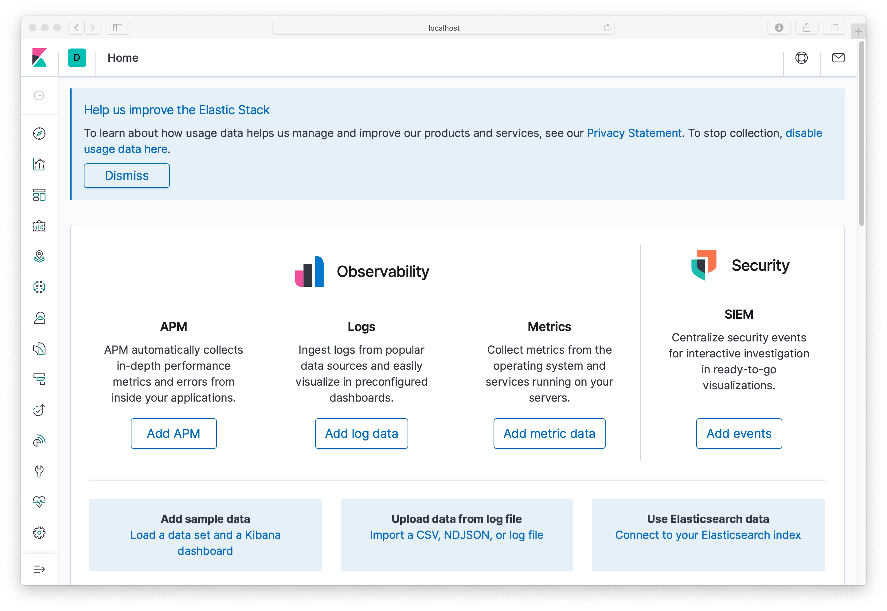
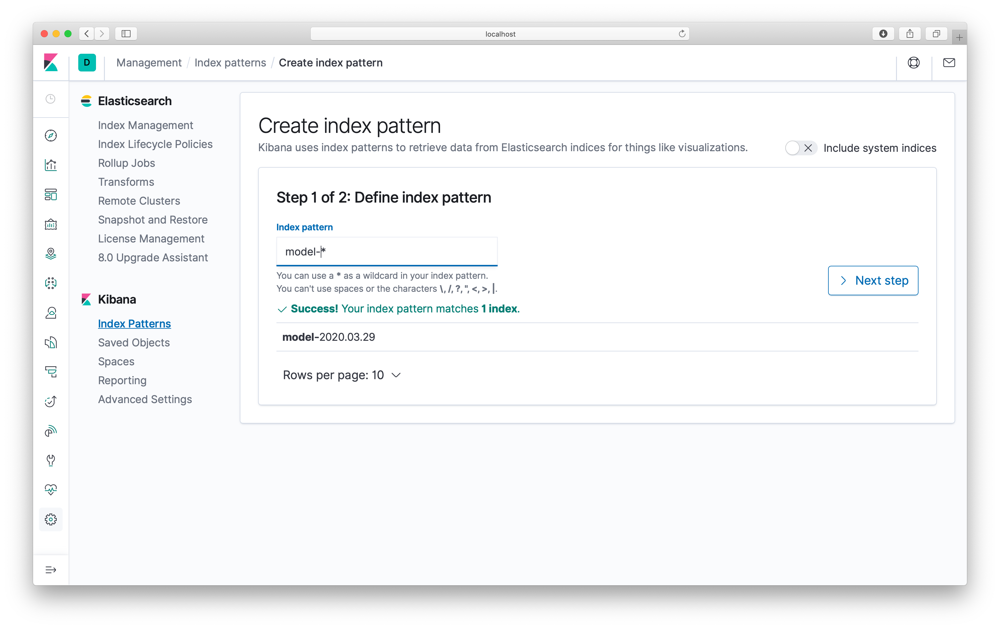
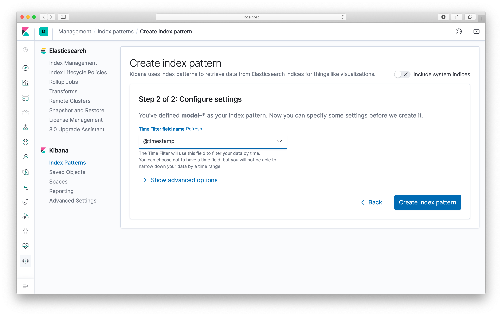
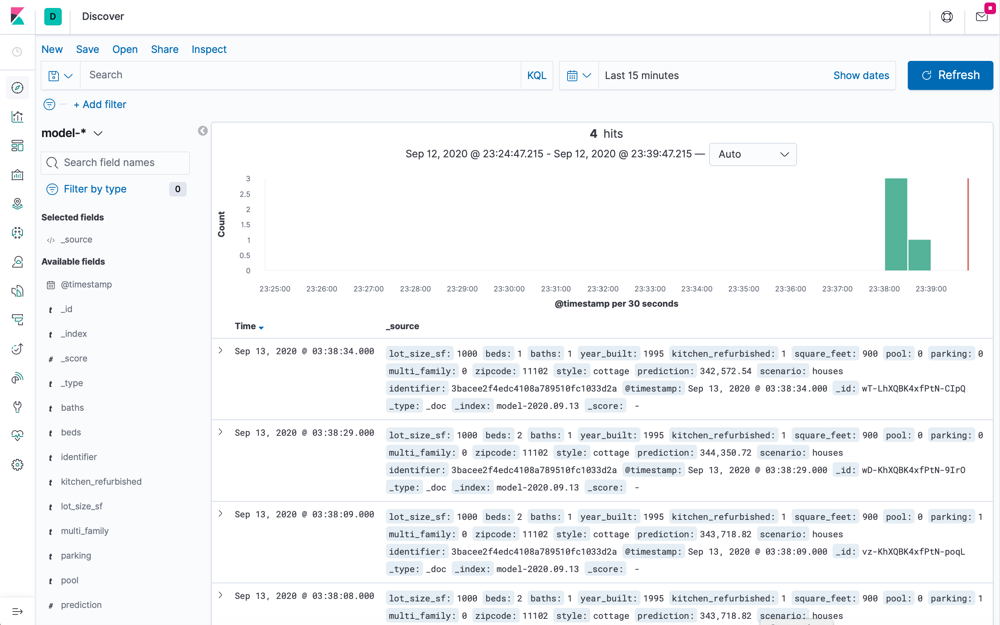
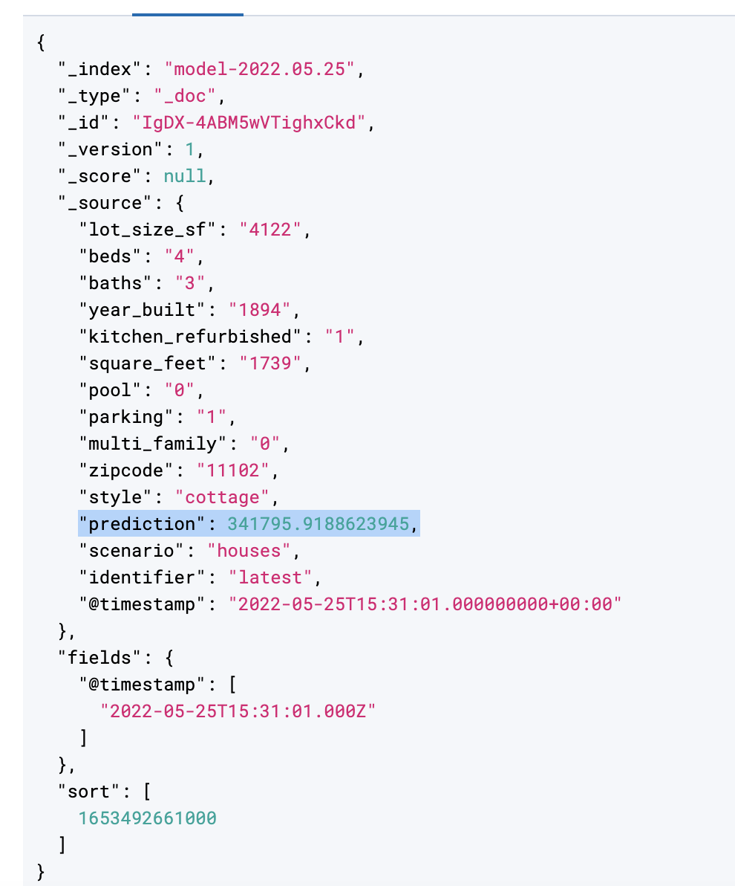
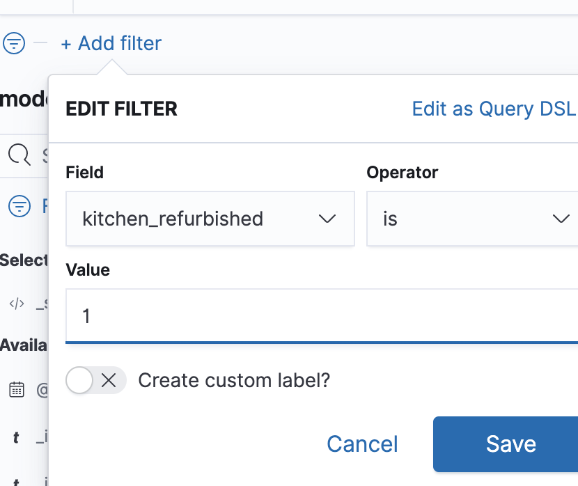

# Exercício 5: Monitoramento e Observabilidade de Modelos

## Objetivos

- Aprender sobre o EFK Stack ([Elasticsearch](https://www.elastic.co/products/elasticsearch),
[FluentD](https://www.fluentd.org/), e [Kibana](https://www.elastic.co/products/kibana)).
- Configurar e implantar a aplicação para registrar eventos de previsão no Elasticsearch.
- Visualizar eventos no painel do Kibana.
- Entender como fechar o ciclo de feedback de dados.

---

## Introdução

Para fechar o ciclo de feedback de dados, podemos registrar eventos em produção e coletar dados sobre o desempenho do nosso modelo em cenários reais. Esses dados podem ser posteriormente curados e rotulados para melhorar o conjunto de dados usado durante o treinamento, permitindo melhorias contínuas nos modelos em produção.

Neste workshop, usamos o EFK Stack como nossa infraestrutura de monitoramento e observabilidade, composto por três principais componentes:

- [Elasticsearch](https://www.elastic.co/products/elasticsearch): um mecanismo de busca de código aberto.
- [FluentD](https://www.fluentd.org/): um coletor de dados de código aberto para camadas de registro unificadas.
- [Kibana](https://www.elastic.co/products/kibana): uma interface web de código aberto que facilita a exploração e visualização dos dados indexados pelo Elasticsearch.

Nosso escopo aqui é coletar dados de previsões ao vivo.

---

## Instruções Passo a Passo

### Passo 1: Certifique-se de que o modelo está carregado

- Execute o pipeline no Jenkins para garantir que um modelo foi carregado recentemente.

---

### Passo 2: Testar o Serviço de Modelos

1. Acesse o [Model Service](http://localhost:11000).
2. Preencha os parâmetros na página de habitação e clique em "Submit" (por exemplo, insira o CEP `11102` ou veja o exemplo no [Setup do Jenkins](../2-SetupJenkins.md)).

---

### Passo 3: Visualizar no Kibana

1. Navegue para o [Kibana](http://localhost:5601):

    

2. Quando a página carregar, selecione "explore on my own" (se solicitado) e clique no ícone "Discover" (bússola) no canto superior esquerdo. Isso levará à página "Create Index Pattern". Insira `model-*` como padrão de índice e clique em "Next Step":

    

3. Na página "Configure Settings", certifique-se de que `@timestamp` está selecionado no dropdown "Time Filter Field name". Clique em "Create Index Pattern":

    

4. Clique novamente no ícone "Discover" (bússola) no canto superior esquerdo para visualizar os logs do modelo. Você verá os horários, nomes dos produtos e previsões feitas:

    

    **Observação**: Cada linha representa um documento JSON contendo todos os parâmetros enviados ao modelo e o resultado da previsão. Expanda uma linha para visualizar os detalhes:

    

---

### Passo 4: Pesquisar Logs no Kibana

1. No Kibana, as informações são pesquisáveis. Por exemplo, você pode adicionar um filtro usando o botão "Add Filter" no canto superior esquerdo e restringir os resultados apenas às previsões onde o parâmetro `kitchen_refurbished` tinha o valor `1`:

    

---

### Passo 5: Encerrar o Ambiente

- Para encerrar o ambiente, execute o comando:
   ```bash
   docker-compose down